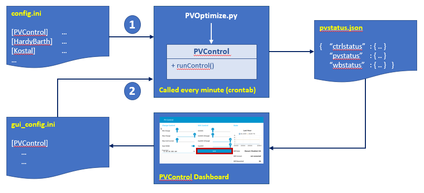
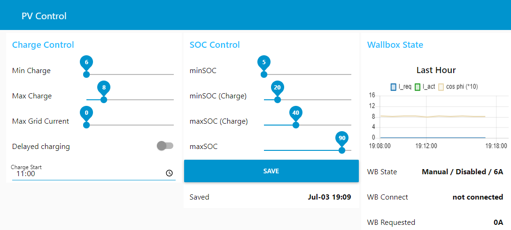

# PVControl
GUI Controller for [PVOptimize](https://stefae.github.io/PVOptimize/)

## Introduction
The project `PVOptimize` allows to flexibly manage how a PV rooftop installation charges an EV. However, the only way to make use of the flexibility is through a `config.ini` file.

This project provides a GUI to control relevant aspects from a [Node-RED Dashboard](https://flows.nodered.org/node/node-red-dashboard). This GUI is an optional addition to `PVOptimize`. Some familiarity with `Node-RED` might be needed to install.

Improvements are welcome - please use *Issues* and *Discussions* in Git.

-------------
## Table of Content
  * [Introduction](#introduction)
  * [Architecture](#architecture)
    - [Enabling the GUI](#enabling-the-gui)
    - [Bootstrapping the Loop](#bootstrapping-the-loop)
  * [Usage of the GUI](#usage-of-the-gui)
  * [Installation](#installation)
  * [Version History](#version-history)
  * [Disclaimer](#disclaimer)
  * [License](#license)

<small><i><a href='http://ecotrust-canada.github.io/markdown-toc/'>Table of contents generated with markdown-toc</a></i></small>

-------------

## Architecture

The following depicts the basic architecture:
* `PVOptimize` is called every minute or so from eg. an appropriate `crontab` entry
* it returns a `pvstatus.json` file with three sections `ctrlstatus` (controller status), `pvstatus` (PV system status) and `wbstatus` (wallbox status)
* this contains sufficient information to initally configure the dashboard (slider lengths, default values, wallbox status to be displayed in rightmost *State* group)
* upon `Save` of the dashboard settings, a `gui_config.ini` is created, which contains `PVControl` items
* on next call of `PVOptimize`, (1) the default config file `config.ini` is read, then (2) the `gui_config.ini` which overwrites values of `config.ini` and thus makes `PVOptimize` behave as configured in the dash board

The dashboard flow is basically generic to `PVOptimize` in version 2.0, except for a section marked as *Hardy Barth specific* (for the *State* group)

### Enabling the GUI

* The GUI is enabled in `config.ini` by setting `PVControl.enableGUI = 1`.
* The files `pvstatus.json` and `gui_config.ini` are located in the directory `PVControl.guiPath`, which defauts to `~/.node-red/projects/PVControl`

### Bootstrapping the Loop

Since the above picture shows a loop, it is essential to understand how it is inialized:
* as soon as `PVControl.enableGUI = 1` is set, `PVOptimize` starts reading `gui_control.ini` and its values will overwrite corresponding values in `config.ini` in section `PVControl`.
* `config.ini` contains default values for slider ranges in the GUI:
  - `HardyBarth.I_chargeMin` and `HardyBarth.I_chargeMax` determine minimum and maximum of sliders in group `Charge Control`
  - `PVStorage.minSOC` determines the lower end of the SOC sliders in group `SOC Control`
* once `PVOptimize` runs (ie., every minute), these values are written into `pvstatus.json`
* the Node-RED flow uses these values when deployed to setup the dashboard - hence if changes are needed, a re-deployment (flow re-start) is required
* once `Save` is pressed in the GUI, a new `gui_control.ini` is created, which is read by next call to `PVOptimize`.
* Note that after every dashboard re-deployment (flow re-start), values will initialize as shown below, independent of actual values in `gui_contro.ini`. Hence, one wants to *save* values immediatly, to gain consistency between display and *behind-the-scenes* activities.

To bootstrap the flow, default files for `pvstatus.json` and `gui_config.ini` are provided, but they may not fit every situation.

## Usage of the GUI

The GUI dashboard is called with `<ip_of_host_running_GUI>:1880/ui` from any browser and should bring up a panel similar to below:

It consists of three groups:
* `Charge Control` and `SOC Control` control the config items as described in [PVOptimize documentation](https://stefae.github.io/PVOptimize/#understanding-configuration-options-for-ev-charging-and-soc-management)
* `State` displays the current state of the wall box and a one-hour history of requested charge current

`Charge Control` contains two additional widgets, not described so far:
* `Start NOW` enables charging immediatly (subject of other constraints of `PVOptimize`)
* `Charge Start` sets a starting time for enabling charging. For this to work, `Start NOW` obviously needs be disabled. Once the time is reached, `Start NOW` is enabled - in other words, `Charge Start` expires after latest 24 hours.

## Installation
The project requires [Node-RED](https://nodered.org/docs/getting-started/raspberrypi) on the same host as [PVOptimize](https://stefae.github.io/PVOptimize/) is installed. It has been developped and seen running with the following versions and components:

| Software | Version |
|----------|---------|
| Node-RED | v 2.1.4 |
| node.js  | 16.13.1 (or 17.3.0) |
| node-red-dashboard | 3.1.3 |
| node-red-contrib-projectdir | 2.0.5 |

Ensure that `Node-RED` is restarted at boot time as described [here](https://nodered.org/docs/faq/starting-node-red-on-boot), using `pm2`

`Node-RED` has to be setup to handle [projects ](https://nodered.org/docs/user-guide/projects/) and the project files reside in `~/node-red/projects/PVControl`. This directory is also used to exchange information with `PVOptimize` as described above. Ensure that this project is deployed.

Once the flow is installed (and a manual trial run successfully executed), enable `PVControl.enableGUI = 1` in `config.ini` of `PVOptimize`. 

## Version History

| Version |Date | Comment |
|---------|-----|---------|
| 1.0     | January 2022 | Initial release |

## Disclaimer
The software controls `PVOptimize`. Errors in the GUI software can result in `PVOptimize` not to perform its desired task - as an example, the EV could remain un-charged in the morning. The author cannot be held liable for this or any other damage caused through the use of this software.

**Use at your own risk!**

Further warranty limitations are implied by the license. Note that `PVOptimize` contains a similar disclaimer.

## License
Distributed under the terms of the GNU General Public License v3.
